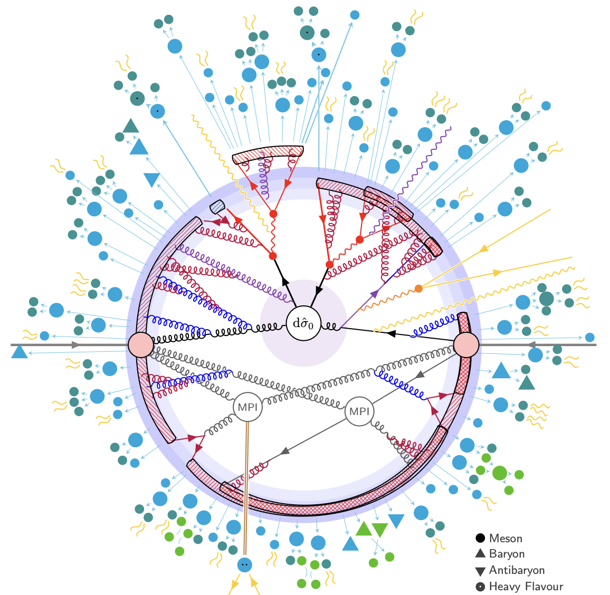

## Welcome to the CMS Data Analysis School 2025 Generators Short Exercise!

This exercise introduces Monte Carlo event generators and how they are used in high energy physics,
focusing on the workflows used in CMS.

<!-- The information and exercises are based on the [2022 CMSDAS](https://twiki.cern.ch/twiki/bin/view/CMS/SWGuideCMSDataAnalysisSchoolLPC2022GeneratorsExercise#Task_1_Using_standalone_MG5) as well as the
[Generator HATS 2021](https://twiki.cern.ch/twiki/bin/viewauth/CMS/GeneratorsHATSatLPC2021).
It has been extended to cover new tools like [NanoGEN](https://twiki.cern.ch/twiki/bin/viewauth/CMS/NanoGen) and introduce generator-related systematic uncertainties. -->

<!-- this is an html comment -->

 This is a comment in Liquid 

> ## Prerequisites
> **Before going any further, please complete the [CMS DAS Pre-Exercises](https://fnallpc.github.io/cms-das-pre-exercises/) and then follow the instructions on the [setup page](setup.md).**
{: .prereq}

> ## Facilitators
> #### Lead Contact
> * [Emery Nibigira](#facilitators), University of Tennessee ([emery.nibigira@cern.ch](mailto:emery.nibigira@cern.ch))
> * [Steve Mrenna](#facilitators), FERMILAB ([stephen.mrenna@cern.ch](mailto:stephen.mrenna@cern.ch))
>  
> #### All Facilitators
> <table>
>   <tr>
>     <td align="center"><a href="https://github.com/enibigir"> <b>Emery Nibigira</b></a> <a href="https://lpc.fnal.gov/fellows/2025/Emery_Nibigira.shtml" title="More about him">🖋</a></td>
>     <td align="center"><a href="https://github.com/smrenna"> <b>Steve Mrenna</b></a> <a href="https://cms.fnal.gov/stephen-mrenna/" title="More about him">🖋</a></td>
<!-- >     <td align="center"><a href="https://github.com/akgrummer"> <b>Aidan Grummer</b></a> <a href="https://github.com/akgrummer" title="More about him">🖋</a></td>
>     <td align="center"><a href="https://github.com/"> <b>Keith Ulmer</b></a> <a href="https://github.com/" title="More about him">🖋</a></td>
>     <td align="center"><a href="https://github.com/"> <b>Kai Yi</b></a> <a href="https://github.com/" title="More about him">🖋</a></td>
>   </tr>
>   <tr>
>     <td align="center"><a href="https://github.com/"> <b>Irene Zoi</b></a> <a href="https://github.com/" title="More about him">🖋</a></td>
>     <td align="center"><a href="https://github.com/"> <b>Sam Bein</b></a> <a href="https://github.com/" title="More about him">🖋</a></td>
>     <td align="center"><a href="https://github.com/"> <b>Brunella D'Anzi</b></a> <a href="https://github.com/" title="More about him">🖋</a></td>
>     <td align="center"><a href="https://github.com/"> <b>Nicola De Filippis</b></a> <a href="https://github.com/" title="More about him">🖋</a></td>
>     <td align="center"><a href="https://github.com/"> <b>Ulascan Sarica</b></a> <a href="https://github.com/" title="More about him">🖋</a></td> -->
>   </tr>
> </table>
{: .testimonial}

> ## Mattermost Chat
> **The [Generators Short Exercise](https://mattermost.web.cern.ch/cmsdaslpc2025/channels/ShortExGenerators) channel will be available once you join the [CMSDAS@LPC2025](https://mattermost.web.cern.ch/cmsdaslpc2025/channels/town-square) team. Direction for how to join this Mattermost chat team can be found on the <a href="setup.html">setup</a> page.**
{: .discussion}


